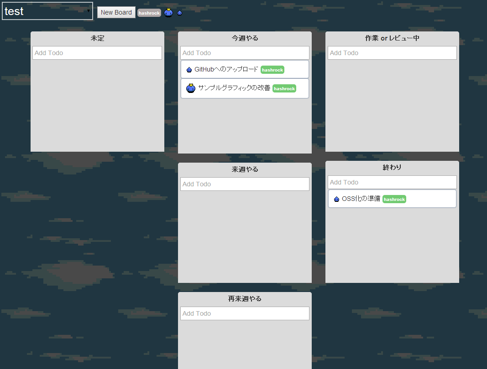

TaskQuest
----------


 * RPG風タスク管理ツールです。
 * 使い方はTrelloみたいな感じですが、スクラム開発向けに最適化してあります。
 * Chrome, FireFoxで動作を確認しています。
 * タスク完了時に、DevHubに通知を送信することが出来ます。




DEMO
-------

http://taskquest-sample.herokuapp.com/#/Sample

[](https://heroku.com/deploy)

制限
------

 * タスクのソートには対応しておりません。
 * タスクの区分けは固定です。

インストール
----------

Node.js, MongoDBが必要です。

```
git clone
cd taskquest
npm install
cp .env.example .env
```

.envを編集し、環境に合わせて下さい。

```
MONGODB_URL=mongodb://localhost:27017 #MongodbのURL
DEVHUB=http://192.168.0.1:3001 #DevHubのアドレス（あれば）
HOST=http://192.168.0.1:3002 #TaskQuest自体のURL（DevHubからのリンクに使います）
```


起動
---------

```
PORT=4000 node bin/www
``` 
 
Development
--------

 * Express4 + Angular.js + Mongooseで開発しています。
 * Viewは単なるHTMLなので、改造は簡単だと思います。
 * 気軽にPull Request下さい。
